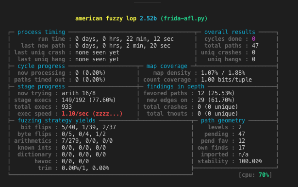

# Frida-AFL



Use Frida DBI to instrument binary and perform basic-block code coverage that is fed back to AFL.

`afl.c` simulate AFL by setting up the shared memory (code-coverage map), by running the target binary (`./simple`) via frida instrumentation and by creating a readable memory map file.

The `frida-afl.py` scripts spawn the target process with ASLR disabled, inject and execute the `bb.js` script and wait for the execution to finish. Unfortunately we cant spawn the process without ASLR with the common `frida` CLI tool.

The env-variable `WHITELIST` should be given to the frida client in order to instrument also dynamic libraries used by the target. If none is given only the main module (target binary) will be instrumented. If you use `all` as value every basic block will be instrumented (no matter which module).

For example:
```
WHITELIST="libplist.3.dylib" frida --no-pause -l bb.js -- /usr/local/bin/plistutil -i ../..//Repos/recipe/ios/Runner/Info.plist
```
Will only track `libplist` basic blocks.

## ToDo's
* ✓ whitelist modules by name
* ✓ spawned process should have ASLR disabled 
* Add log to file facility to frida
* Verify that crashes are actually detected on Mac OS X
* Improve how the base module is being detected (currently just take the first item from the array of the process's modules)
* Create afl-fuzz wrapper
* Implement forkserver in frida (to avoid `AFL_NO_FORKSRV=1`)
* Write compile block callback in C (`CModule`) to improve perf

## References
* [Frida Javascript API References](https://www.frida.re/docs/javascript-api/)
* [AFL-Dynamorio](https://github.com/vanhauser-thc/afl-dynamorio) by Vanhauser

## Example Runs

### afl mock

```
$ WHITELIST="simple" ./afl
Set shm 4194304 mapped to 0x105b74000
Executing simple
Spawning ./simple 
Found export for getenv!
Prepared native function @ 0x7fff733d77ce
Shared memory ID: 4194304
Whitelist:  simple
trace_bits mapped at 0x100530000
Done stalking threads.
[simple] 1
0x100000f10 -> 0x100000f37 ( simple : 0x100000000 - 0x100001000 )
map_offset: 0 id: 1928 prev_id: 964 , target: 0x100530000 , current: 0
0x100000f63 -> 0x100000f7b ( simple : 0x100000000 - 0x100001000 )
map_offset: 964 id: 1969 prev_id: 984 , target: 0x1005303c4 , current: 0
0x100000f8a -> 0x100000f90 ( simple : 0x100000000 - 0x100001000 )
map_offset: 984 id: 1989 prev_id: 994 , target: 0x1005303d8 , current: 0
0x100000fa0 -> 0x100000faa ( simple : 0x100000000 - 0x100001000 )
map_offset: 994 id: 2000 prev_id: 1000 , target: 0x1005303e2 , current: 0
0x100000f90 -> 0x100000f9f ( simple : 0x100000000 - 0x100001000 )
map_offset: 1000 id: 1992 prev_id: 996 , target: 0x1005303e8 , current: 0
0x100000f7b -> 0x100000f89 ( simple : 0x100000000 - 0x100001000 )
map_offset: 996 id: 1981 prev_id: 990 , target: 0x1005303e4 , current: 0
Monitored 6  blocks!
Shared memory unmapped!
Exiting!
Execution result: 0
Shared memory cleaned up!
bash-3.2$ cat map.txt 
000000:1
000964:1
000984:1
000994:1
000996:1
001000:1
```

### afl-fuzz
```
$ WHITELIST="file" AFL_SKIP_BIN_CHECK=1 AFL_NO_FORKSRV=1 afl-fuzz -m 800 -i in_file/ -o out/ -t 5000 -- ./frida-afl.py `which file` @@
afl-fuzz 2.52b by <lcamtuf@google.com>
[+] You have 4 CPU cores and 5 runnable tasks (utilization: 125%).
[*] Setting up output directories...
[+] Output directory exists but deemed OK to reuse.
[*] Deleting old session data...
[+] Output dir cleanup successful.
[*] Scanning 'in_file/'...
[+] No auto-generated dictionary tokens to reuse.
[*] Creating hard links for all input files...
[*] Validating target binary...
[*] Attempting dry run with 'id:000000,orig:CVE-2014-1943.testfile'...
    len = 5, map size = 701, exec speed = 1108872 us
[!] WARNING: Recompile binary with newer version of afl to improve coverage!
[*] Attempting dry run with 'id:000001,orig:JW07022A.mp3.testfile'...
    len = 15887, map size = 829, exec speed = 1047048 us
[*] Attempting dry run with 'id:000002,orig:cl8m8ocofedso.testfile'...
    len = 27777, map size = 887, exec speed = 1059680 us
[*] Attempting dry run with 'id:000003,orig:escapevel.testfile'...
    len = 8813, map size = 847, exec speed = 1123566 us
...
```

### afl-showmap

```
$ WHITELIST="libplist.3.dylib" afl-showmap -m 800 -o /tmp/out.log -- ./frida-afl.py /usr/local/bin/plistutil -i in/Info.plist
afl-showmap 2.52b by <lcamtuf@google.com>
[*] Executing './frida-afl.py'...

-- Program output begins --
__AFL_SHM_ID is 6946816
Spawning /usr/local/bin/plistutil -i in/Info.plist 
Found export for getenv!
Prepared native function @ 0x7fff733d77ce
Shared memory ID: 6946816
Whitelist:  libplist.3.dylib
trace_bits mapped at 0x100540000
Done stalking threads.
bplist00�WMachine�

                  TInfo�
XextrakeyZextravalueRosYSAMPLE OSXhardwareVx86_64TName_LNT SAMPLE MACHINE
oExiting!                                                               $-8;ENUZ
-- Program output ends --
[+] Captured 538 tuples in '/tmp/out.log'.
bash-3.2$ cat /tmp/out.log 
000000:1
017655:1
017659:1
...
```